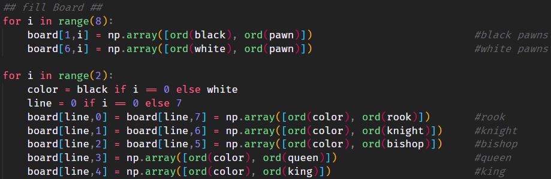

<h1 align="center">
     
    Py-Chess
     
</h1>

Py-Chess is a project by two friends who just like to code in their freetime.

## Installation

nstall python requirements
`$ python3 -m pip install -r requirements.txt`

> Tip: use a python venv
> `python3 -m venv .venv`
> `source .venv/bin/activate`

## Possible plans in the future

- create a ML algorithm to play as AI
